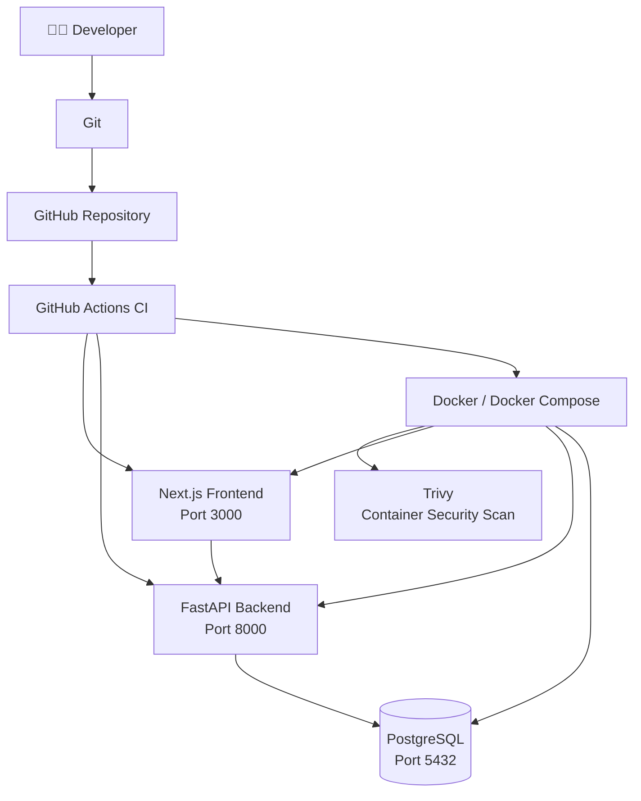
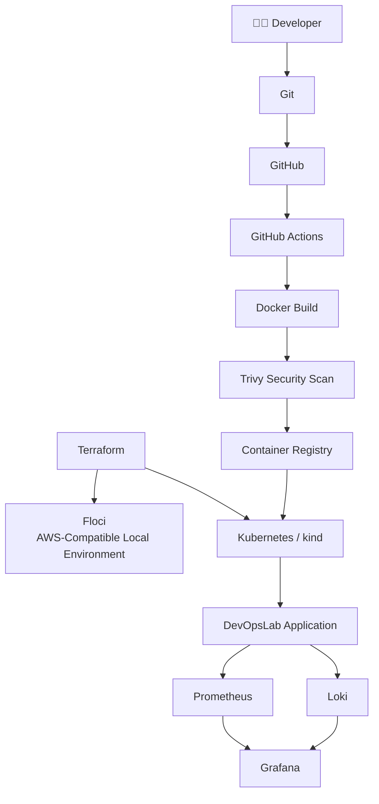

DevOpsLab 🚀

> A local-first DevOps learning and automation platform built to practice the complete DevOps lifecycle — from application development and containerization to CI/CD, security scanning, infrastructure, Kubernetes, and observability.

DevOpsLab is a hands-on project designed to turn DevOps concepts into working infrastructure.

Instead of learning individual tools in isolation, the goal is to connect them into one realistic workflow:

**Code → Build → Test → Containerize → Scan → Deploy → Observe**

The project is being built incrementally, with every failure treated as part of the learning process.

---

## 🎯 Why DevOpsLab?

DevOps is not just about knowing Docker, Kubernetes, Terraform, or GitHub Actions individually.

The real skill is understanding how these tools work together.

DevOpsLab was created to answer practical questions such as:

* How does application code move from a Git commit to a running service?
* How should secrets be handled?
* How can Docker images be tested automatically?
* How does CI detect broken builds?
* How do security vulnerabilities affect a deployment pipeline?
* How can infrastructure be reproduced with code?
* How do containers eventually become Kubernetes workloads?
* How can applications be monitored after deployment?

The project is intentionally being built **one layer at a time**.

---

# 🏗️ Architecture

### Current architecture



### Planned architecture

The long-term architecture expands the local application into a complete DevOps platform:



> The second diagram represents the planned evolution of DevOpsLab, not functionality that is already complete.

---

# 🧰 Tech Stack

| Area                             | Technology             |
| -------------------------------- | ---------------------- |
| Frontend                         | Next.js                |
| Language                         | TypeScript             |
| Styling                          | Tailwind CSS           |
| Backend                          | FastAPI                |
| Language                         | Python                 |
| Database                         | PostgreSQL             |
| Containers                       | Docker                 |
| Local orchestration              | Docker Compose         |
| Version control                  | Git                    |
| Repository                       | GitHub                 |
| CI/CD                            | GitHub Actions         |
| Security scanning                | Trivy                  |
| Infrastructure                   | Terraform *(planned)*  |
| AWS-compatible local environment | Floci *(planned)*      |
| Kubernetes                       | kind *(planned)*       |
| Metrics                          | Prometheus *(planned)* |
| Dashboards                       | Grafana *(planned)*    |
| Logs                             | Loki *(planned)*       |

---

# 📂 Project Structure

```text
devopslab/
│
├── backend/
│   ├── app/
│   │   ├── database.py
│   │   ├── main.py
│   │   └── ...
│   ├── Dockerfile
│   └── requirements.txt
│
├── frontend/
│   ├── app/
│   ├── public/
│   ├── package.json
│   ├── package-lock.json
│   └── Dockerfile
│
├── .github/
│   └── workflows/
│       └── ci.yml
│
├── .env.example
├── .gitignore
├── docker-compose.yml
└── README.md
```

---

# 🚀 Current Features

## 1. Next.js Dashboard

The frontend provides the initial DevOpsLab dashboard.

Current labs include:

* Linux
* Git
* Docker
* CI/CD

Each lab has a basic status such as:

```text
not_started
```

The dashboard communicates with the FastAPI backend.

---

## 2. FastAPI Backend

The backend exposes API endpoints for the application.

Example health endpoint:

```text
GET /health
```

Response:

```json
{
  "status": "healthy"
}
```

The backend also exposes the initial lab data through:

```text
GET /labs
```

---

## 3. PostgreSQL

PostgreSQL is currently used as the application's database service.

Docker Compose manages the database alongside the frontend and backend.

The database configuration is supplied through environment variables rather than hardcoded directly into the application.

---

# 🐳 Docker

The application is containerized using Docker.

The current Compose stack contains:

```text
frontend
backend
postgres
```

Start the complete local environment:

```bash
docker compose up -d --build
```

Check running containers:

```bash
docker compose ps
```

Stop the environment:

```bash
docker compose down
```

The application is available at:

```text
Frontend: http://localhost:3000
Backend:  http://localhost:8000
```

---

# 🔄 CI Pipeline

DevOpsLab uses GitHub Actions to automatically validate changes.

The current pipeline performs:

```text
Git Push
   ↓
Checkout
   ↓
Backend dependency installation
   ↓
Python syntax check
   ↓
Frontend dependency installation
   ↓
Frontend build
   ↓
Docker image build
   ↓
Trivy security scan
```

This means a change is not simply pushed and assumed to work.

The repository automatically checks whether the project can still be built.

---

# 🔐 Security Scanning with Trivy

Container images are scanned with Trivy.

The CI pipeline checks for:

```text
HIGH
CRITICAL
```

severity vulnerabilities.

The important lesson here is that:

> A successful Docker build does not mean a secure Docker image.

During development, the backend image initially contained a significant number of HIGH vulnerabilities originating from the underlying Debian packages.

This caused the GitHub Actions pipeline to fail.

That failure was intentional from the perspective of the pipeline:

```text
Vulnerability detected
        ↓
Trivy exits with code 1
        ↓
CI fails
        ↓
Problem must be investigated
```

This is an important DevSecOps principle:

**security checks should be part of the delivery pipeline rather than an afterthought.**

---

# 🔑 Configuration & Secrets

Environment-specific configuration is kept outside the source code.

The project uses environment variables such as:

```text
POSTGRES_DB
POSTGRES_USER
POSTGRES_PASSWORD
DATABASE_URL
```

The local `.env` file is intentionally excluded from Git through `.gitignore`.

Example configuration is represented separately so that developers know which variables are required without committing real credentials.

> Never commit `.env` files containing real credentials.

---

# 🧠 What I Learned

## 1. Docker is more than "put the app in a container"

Building the application with Docker made the relationship between:

```text
Application
+
Runtime
+
Dependencies
+
Operating System
```

much clearer.

A Docker image contains more than application code.

The underlying OS packages can also introduce vulnerabilities.

That became obvious when Trivy scanned the backend image.

---

## 2. CI catches problems that local development can miss

The application could build successfully locally while the CI security stage still failed.

That demonstrated an important difference:

```text
"It works on my machine"
```

is not the same as:

```text
"It passed the delivery pipeline."
```

CI provides a repeatable environment for validating changes.

---

## 3. Security scanning is not just a checkbox

The first Trivy scan reported:

```text
44 HIGH
0 CRITICAL
```

vulnerabilities in the backend image.

The vulnerabilities were primarily associated with packages from the Debian base layer rather than Python application dependencies.

This taught me to investigate the entire container image rather than only checking application packages.

---

## 4. Base images matter

Changing application code is not always the solution to an image vulnerability.

The vulnerability may come from:

```text
Python
  ↓
Base image
  ↓
Debian packages
```

This makes the choice of base image an important part of container security.

---

## 5. CI failure is useful information

A failed pipeline is not necessarily a bad outcome.

For DevOpsLab, failures are treated as debugging opportunities.

The workflow becomes:

```text
Change
 ↓
Build
 ↓
Failure
 ↓
Investigate
 ↓
Fix
 ↓
Build again
```

This is much closer to real DevOps work than simply following a tutorial where everything works on the first attempt.

---

# 💥 What Broke

## Docker image security scan failed

The first Trivy scan failed because the backend image contained HIGH-severity vulnerabilities.

The pipeline correctly stopped instead of ignoring them.

The initial assumption was that installing Python dependencies was the primary concern.

The scan showed otherwise.

The vulnerable packages were mostly operating-system packages from the Debian layer.

---

## `apt-get upgrade` didn't magically fix everything

The Dockerfile was updated to upgrade available Debian packages during the build:

```dockerfile
RUN apt-get update \
    && apt-get upgrade -y \
    && rm -rf /var/lib/apt/lists/*
```

The image rebuilt successfully.

However, Trivy still reported HIGH vulnerabilities.

This was an important lesson:

> Updating packages is useful, but it does not guarantee that every vulnerability disappears.

Some vulnerabilities may have no available fix yet, may be deferred, or may depend on the base distribution version.

---

## Trivy couldn't initially see the local Docker image

When Trivy was first run inside a container, it couldn't access the Docker image built on the host.

The error was caused by the Trivy container not having access to the host Docker daemon.

The solution was to mount the Docker socket:

```bash
docker run --rm \
  -v /var/run/docker.sock:/var/run/docker.sock \
  aquasec/trivy:latest \
  image --severity HIGH,CRITICAL devopslab-backend:security-test
```

That worked.

This taught me an important container concept:

> A container normally cannot automatically see or control the host's Docker daemon.

---

# 🧪 Debugging Approach

When something breaks, I try to reduce the problem into smaller layers.

For example:

```text
Is the application working?
        ↓
Is the container building?
        ↓
Is the container running?
        ↓
Can the service communicate?
        ↓
Does CI reproduce the build?
        ↓
Does security scanning pass?
```

This approach makes debugging much easier than changing multiple things at once.

---

# 🗺️ Roadmap

DevOpsLab is being developed in stages.

### ✅ Phase 1 — Application Foundation

* [x] Next.js frontend
* [x] FastAPI backend
* [x] PostgreSQL
* [x] Basic dashboard
* [x] API health endpoint

### ✅ Phase 2 — Containerization

* [x] Dockerfiles
* [x] Docker Compose
* [x] PostgreSQL container
* [x] Frontend container
* [x] Backend container

### ✅ Phase 3 — Git & CI

* [x] Git repository
* [x] GitHub repository
* [x] GitHub Actions
* [x] Backend validation
* [x] Frontend build

### 🔄 Phase 4 — DevSecOps

* [x] Docker image builds in CI
* [x] Trivy integration
* [x] HIGH/CRITICAL vulnerability policy
* [ ] Resolve remaining image vulnerabilities
* [ ] Automated security reporting

### ⏳ Phase 5 — Infrastructure

* [ ] Floci
* [ ] Terraform
* [ ] Infrastructure modules
* [ ] Local AWS-compatible infrastructure

### ⏳ Phase 6 — Kubernetes

* [ ] kind cluster
* [ ] Kubernetes manifests
* [ ] Deployments
* [ ] Services
* [ ] ConfigMaps
* [ ] Secrets
* [ ] Health checks
* [ ] Rolling deployments

### ⏳ Phase 7 — Observability

* [ ] Prometheus
* [ ] Grafana
* [ ] Application metrics
* [ ] Loki
* [ ] Centralized logs
* [ ] Dashboards
* [ ] Alerts

### ⏳ Phase 8 — DevOps Automation Engine

The long-term goal is for DevOpsLab itself to become a control plane for the learning environment.

Potential workflow:

```text
User
 ↓
DevOpsLab Dashboard
 ↓
Backend API
 ↓
Automation Engine
 ↓
Terraform / Docker / Kubernetes
 ↓
Infrastructure
 ↓
Monitoring
 ↓
Logs + Metrics
 ↓
Dashboard
```

---

# 🧑‍💻 Running Locally

Clone the repository:

```bash
git clone git@github.com:tushargkale/devopslab.git
cd devopslab
```

Create your local environment file:

```bash
cp .env.example .env
```

Then start the application:

```bash
docker compose up -d --build
```

Check the services:

```bash
docker compose ps
```

Check the backend:

```bash
curl http://localhost:8000/health
```

Expected:

```json
{
  "status": "healthy"
}
```

Open the frontend:

```text
http://localhost:3000
```

---

# 📈 DevOpsLab Philosophy

The project follows three principles:

### Build it

Don't just read about the tool.

Use it.

### Break it

Failures expose gaps in understanding.

### Fix it

Document the failure, understand the root cause, and improve the system.

The objective isn't to create a perfect demo where nothing ever fails.

The objective is to build enough of the system that failures become realistic DevOps problems to solve.

---

# 📌 Current Status

**DevOpsLab is actively under development.**

The application foundation, Docker environment, GitHub workflow, Docker image builds, and initial Trivy security scanning are working.

The project is currently focused on improving container security before moving deeper into infrastructure automation.

---

DevOps learning project focused on:

* Linux
* Git
* Docker
* CI/CD
* DevSecOps
* Infrastructure as Code
* Kubernetes
* Observability
* Automation

---
